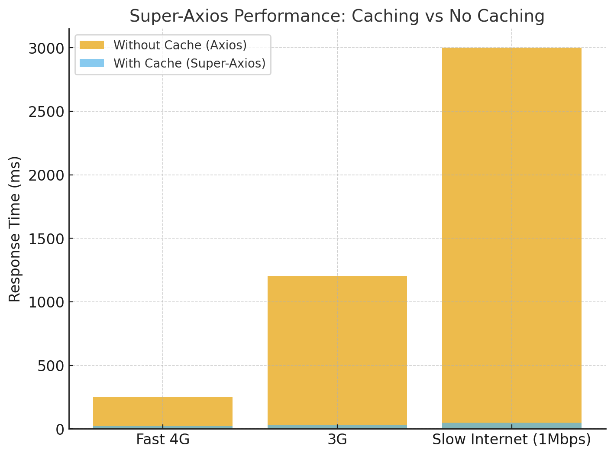

# @qbit-labs/super-axios

[](https://www.npmjs.com/package/@qbit-labs/super-axios)
[](https://www.npmjs.com/package/@qbit-labs/super-axios)
[](LICENSE)

A lightweight wrapper around [Axios](https://axios-http.com/) with **built-in caching**.  
It stores API responses in **IndexedDB** (if available) or falls back to **localStorage**.  
Perfect for reducing duplicate requests, speeding up apps, and working offline-friendly.  

---

## ✨ Features
- ⚡ **Drop-in replacement for Axios** (all axios features still available)  
- 📦 **Smart caching**: caches responses automatically by URL + payload  
- 🔑 **Custom cache keys** for finer control  
- 🗄️ **Storage options**: IndexedDB or localStorage (auto fallback)  
- ⏱️ **Configurable stale times**: control how long cached data stays fresh  
- 🚀 **Works with GET, POST, DELETE, PUT, etc.**  

---


## 📊 Performance Benchmark

Super-Axios drastically improves response times on repeated requests compared to raw Axios.



| Network Speed | Without Cache (Axios) | With Cache (Super-Axios) | Improvement |
|---------------|------------------------|---------------------------|-------------|
| **Fast 4G**   | ~250ms                 | ~20ms                     | 🚀 ~92% faster |
| **3G**        | ~1200ms                | ~30ms                     | 🚀 ~97% faster |
| **Slow Internet (1Mbps)** | ~3000ms      | ~50ms                     | 🚀 ~98% faster |

---

## Key Notes
- **Without cache** → Every request goes to the server, causing delays especially on slower networks.  
- **With cache** → Subsequent requests for the same key are served instantly from IndexedDB/LocalStorage.  
- **Use Case**: Ideal for apps where repeated data fetching occurs (e.g., user profiles, product lists).

---

## 📦 Installation

```bash
pnpm install @qbit-labs/super-axios
```

Or with npm/yarn:

```bash
npm install @qbit-labs/super-axios
# or
yarn add @qbit-labs/super-axios
```

---

## ⚙️ Usage

```ts
import axios from "axios";
import { createSuperAxios } from "@qbit-labs/super-axios";

// Create a super-axios instance
const api = createSuperAxios(axios, {
  storage: "auto", // "auto" | "localStorage" | "indexedDB"
  defaultCacheOptions: {
    useCache: true,      // default false
    staleTime: 5 * 60 * 1000, // 5 minutes by default
  },
});
```

---

## 📘 Examples

### 1. GET request with cache
```ts
const response = await api.get("https://jsonplaceholder.typicode.com/todos/1", {
  cacheOptions: {
    useCache: true,
    staleTime: 10000, // 10 seconds
  },
});

console.log(response.data);
```

---

### 2. POST request with custom cache key
```ts
const response = await api.post(
  "https://jsonplaceholder.typicode.com/posts",
  {
    title: "foo",
    body: "bar",
    userId: 1,
  },
  {
    cacheOptions: {
      useCache: true,
      staleTime: 10000, // 10 seconds
      key: "custom-post-key", // cache key override
    },
  }
);

console.log(response.data);
```

---

### 3. DELETE request with caching
```ts
const response = await api.delete(
  "https://jsonplaceholder.typicode.com/posts/1",
  {
    cacheOptions: {
      useCache: true,
      staleTime: 10000,
    },
  }
);

console.log(response.data);
```

---

### 4. Permanent caching (never stale)
```ts
const response = await api.get("https://jsonplaceholder.typicode.com/todos/1", {
  cacheOptions: {
    useCache: true,
    staleTime: -1, // never expires
  },
});

console.log(response.data);
```

---

## ⚡ Cache Options

Each request supports a `cacheOptions` field:

| Option      | Type    | Default   | Description |
|-------------|---------|-----------|-------------|
| `useCache`  | boolean | `false`   | Whether to use caching for this request |
| `staleTime` | number  | `300000` (5 min) | How long (in ms) the cached data is valid. Use `-1` for **never stale** |
| `key`       | string  | auto-generated (`url+payload`) | Custom cache key |

---

## 🔧 API

### `createSuperAxios(axiosInstance, options)`

#### Parameters:
- **axiosInstance**: Your axios instance (or `axios` directly).  
- **options**:  
  - `storage`: `"auto" | "localStorage" | "indexedDB"`  
  - `defaultCacheOptions`: `{ useCache?: boolean; staleTime?: number }`  

#### Returns:
A **super-axios instance** with all axios methods (`get`, `post`, `put`, `delete`, etc.) + caching.

---

## 🔄 Revalidation (optional)

If you need to **force refresh** the cache manually:  

```ts
await api.revalidate("custom-post-key");
```

---

## 🗑️ Cleanup (optional)

If you need to **force clear** the cache manually:  

```ts
await api.clear();
```

---

## ✅ Summary
- Install with `pnpm install @qbit-labs/super-axios`  
- Create a wrapper with `createSuperAxios`  
- Use `cacheOptions` to control per-request caching  
- Works the same as axios but **faster with caching**  
